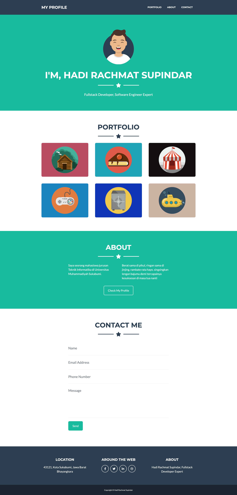

### Tugas Membuat Template

- Pelajari gambar wireframe template dibawah ini.
- Buat file HTML dengan nama `template01.html`
- CSS Frameworknya pakai Bootstrap
- Buat file CSS dengan nama `template01.css` lalu panggil di file `template01.html` yang sudah di buat sebelumnya.
- Buat folder javascript dan buat didalamnya 1 file javascript dengan nama `template01.js` lalu panggil di file `template01.html` yang sudah di buat sebelumnya.
- branch git nya kerjain di branch `dev` awas jangan sampai salah.

### Wirerframe Konsep Template

### Catatan

- Buat Codingan serapih mungkin dengan penamaan `class` atau `id ` yang baik dan benar sehingga bisa dibaca oleh team engineer.